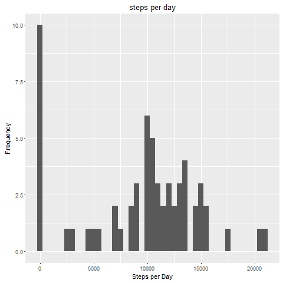
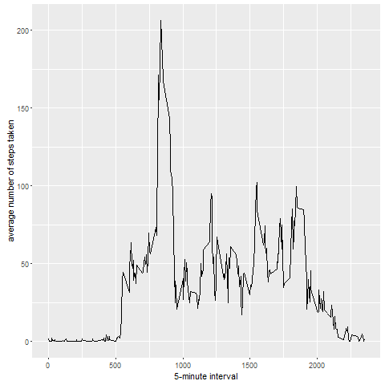
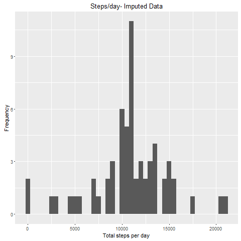
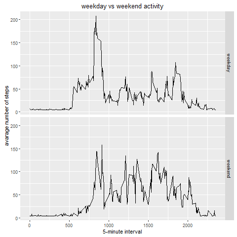

# Reproducible Research: Peer Assessment 1
dojohnloydb  
# Reproducible Research: Peer Assessment 1

## Loading and preprocessing the data
###1. Load the data (i.e. read.csv())

```r
require(ggplot2)
```

```
## Loading required package: ggplot2
```

```r
activity_data <- read.csv('activity.csv')
```


## What is mean total number of steps taken per day?

```r
stepsperday<-tapply(activity_data$steps,activity_data$date,sum,na.rm=T)
```


###1. Make a histogram of the total number of steps taken each day

```r
qplot(stepsperday,binwidth=500,xlab = 'Steps per Day',ylab = 'Frequency',main = 'steps per day')
```

<!-- -->

 

###2. Calculate and report the mean and median total number of steps taken per day


```r
avg_steps<-mean(stepsperday)
median_steps<-median(stepsperday)
```
*Mean 9354.2295082
*Median 10395

## What is the average daily activity pattern?

```r
avg_steps_5min<-aggregate(list(avg_steps=activity_data$steps),by=list(interval=activity_data$interval),FUN=mean,na.rm=T)
```


###1. Make a time series plot

```r
ggplot(data=avg_steps_5min, aes(x=interval, y=avg_steps)) +
      geom_line() +
       xlab("5-minute interval") +
       ylab("average number of steps taken")
```

<!-- -->
 


###2. Which 5-minute interval, on average across all the days in the dataset, contains the maximum number of steps?

```r
max_index<-which.max(avg_steps_5min$avg_steps)
max_time <-  gsub("([0-9]{1,2})([0-9]{2})", "\\1:\\2",avg_steps_5min[max_index,'interval'])
```

*Maximum number of steps at 8:35 


## Imputing missing values


###1. Calculate and report the total number of missing values in the dataset

```r
totalNA <-sum(is.na(activity_data$steps))
```
*total missing values 2304

###2. Devise a strategy for filling in all of the missing values in the dataset.


```r
require(Hmisc)
```

```
## Loading required package: Hmisc
```

```
## Loading required package: lattice
```

```
## Loading required package: survival
```

```
## Loading required package: Formula
```

```
## 
## Attaching package: 'Hmisc'
```

```
## The following objects are masked from 'package:base':
## 
##     format.pval, round.POSIXt, trunc.POSIXt, units
```

###3. Create a new dataset that is equal to the original dataset but with the missing data filled in.

```r
activity_data_imputed<-activity_data
activity_data_imputed$steps <- impute(activity_data$steps, fun=mean)
```


###4. Make a histogram of the total number of steps taken each day

```r
stepsperday_imputed <- tapply(activity_data_imputed$steps, activity_data_imputed$date, sum)

qplot(stepsperday_imputed, xlab='Total steps per day',      ylab='Frequency', binwidth=500,main = 'Steps/day- Imputed Data')
```

<!-- -->

 


###... and Calculate and report the mean and median total number of steps taken per day.

```r
stepsperday_imputed_mean <- mean(stepsperday_imputed)
stepsperday_imputed_median <- median(stepsperday_imputed)
```

*average steps/day 1.0766189\times 10^{4}
*median steps/day 1.0766189\times 10^{4}

## Are there differences in activity patterns between weekdays and weekends?

###1. Create a new factor variable in the dataset with two levels - "weekday" and "weekend" indicating whether a given date is a weekday or weekend day.


```r
activity_data_imputed$day <-  ifelse(as.POSIXlt(activity_data_imputed$date)$wday %in% c(0,6), 'weekend', 'weekday')
avg_steps_daywise<-aggregate(steps~interval+day,data = activity_data_imputed,FUN = mean)
```


###2. Make a panel plot containing a time series plot

```r
ggplot(avg_steps_daywise, aes(interval, steps)) + 
       geom_line() + 
       facet_grid(day ~ .) +
       xlab("5-minute interval") + 
       ylab("avarage number of steps")+
       ggtitle('weekday vs weekend activity')
```

<!-- -->


